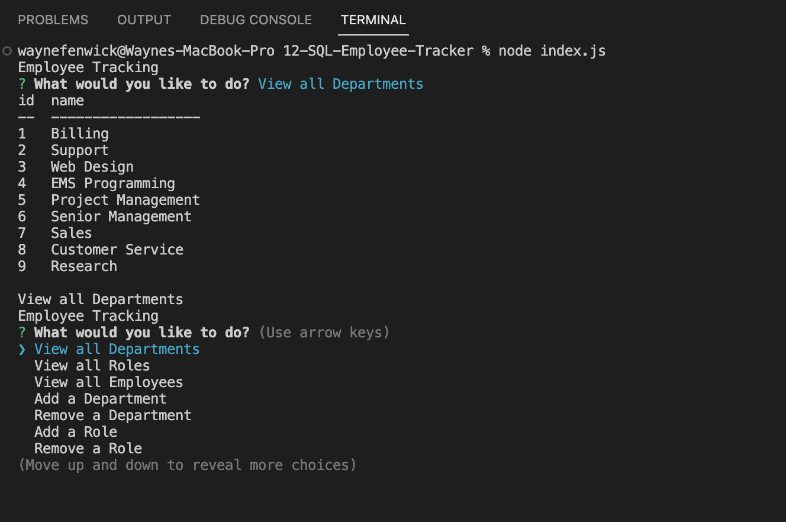

# 12-SQL-Employee-Tracker

## License
&nbsp;

* Select the badge to see details.
* To see more about license badges, visit [Shields IO](https://shields.io/category/license)

&nbsp;

## Description
The purpose of the project is to create an app that business owners can use to better manage their departments, employees, roles and budgets for more efficient business management.

&nbsp;

## Table of Contents

 * [Installation](#installation)
 * [Usage](#usage)
 * [Media](#media)
 * [Testing](#testing)
 * [Contribution](#contribution)
 

&nbsp;

## Installation

Users will need to have some basic MySQL experience. To get started, install necessary components from the links provided below.
1. Clone the repository to your PC.
2. Update the schema.sql and seeds.sql files with your own data.
3. When you open the directory, use npm to install inquirer and util modules.
4. Open a terminal from the project folder containing the schema and seeds files and log into your MySQL account.
5. Upload the schema.sql and seeds.sql data.

* [Node.js Installation](https://nodejs.org/en)

* [MySQL Installation via NPM](https://www.npmjs.com/package/mysql2)

* [MySQL Installation Guideline](https://dev.mysql.com/doc/mysql-getting-started/en/#mysql-getting-started-installing)

* [MySQL documentation to get you started](https://dev.mysql.com/doc/refman/8.0/en/mysql-batch-commands.html)

* [MySql Workbench is a very helpful tool to have](https://dev.mysql.com/downloads/workbench/)

&nbsp;

[Table of Contents](#table-of-contents)

## Usage

Once you have installed the necessary components, you can invoke this application as follows:
1. Open a terminal window from the index.js file
2. Type in 'node index.js' and you will be prompted with questions.
3. These will help get you started with tables of data based on your schema.sql and seeds.sql files.

&nbsp;

[Table of Contents](#table-of-contents)

## Media
_A snapshot of the project build_
&nbsp;

* Watch a [Full Media Video](https://drive.google.com/file/d/1EtNH5nPQ7EUeQWeatgtJMCXb2c-J4BZY/view?usp=sharing) to see how this works.

&nbsp;

[Table of Contents](#table-of-contents)

## Testing

Test how this application works. It is open for further development with the goal being to create a user friendly environment that is quick and easy use in retrieving combinations of useful company data from a database of information.

&nbsp;

[Table of Contents](#table-of-contents)

## Contribution

* General internet research!

&nbsp;

[Table of Contents](#table-of-contents)

## Questions

_If you have any questions, please feel free to contact me._

GitHub Username: [waynefenwick](https://github.com/waynefenwick)

Email Address: <a href="mailto:waynefenwick@gmail.com">waynefenwick@gmail.com</a>

&nbsp;

_Thanks for taking time to visit this repository!_

[Back to Top](#)

